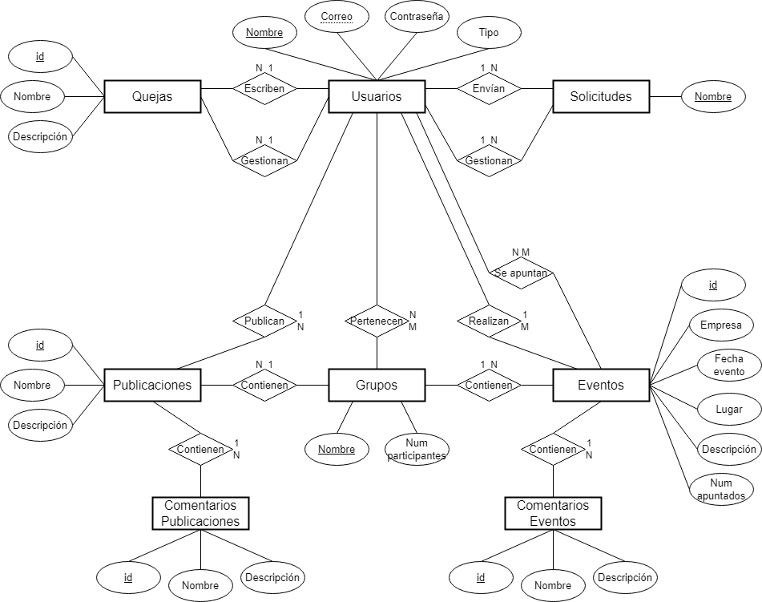
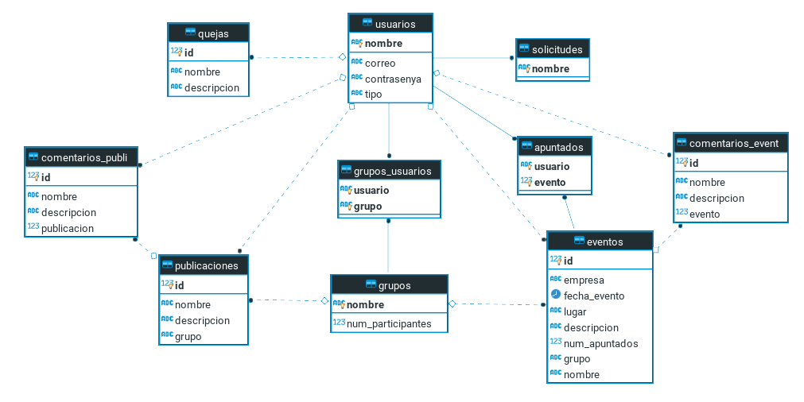

# Desarrollo y construcción de una aplicación web que cumpla los requisitos de un sistema de información

## Índice

- Objetivo y alcance funcional de la aplicación.
   - Objetivos
   - Perfiles de usuario
   - Funcionalidades del sistema
- Modelo de datos del sistema.
   - Modelo Entidad-Relación
   - Modelo Relacional
   - Diseño de las clases implementadas en la capa de persistencia de datos
- Puesta en marcha del sistema de información.
   - Procedimiento para el despliegue e instalación de la aplicación
   - Cuestiones necesarias para el uso de la aplicación

## Objetivo y alcance funcional de la aplicación.

### Objetivos

Es un hecho que las probabilidades de congeniar con personas que compartan gustos musicales similares es más alta que cuando dichos gustos son disparejos. Ante este dato, se ha planteado desarrollar una aplicación web que cubra la necesidad de relacionarse con aquellas otras personas que compartan determinados géneros musicales. Para ayudar en el proceso, en la red social a desarrollar se publicarán los próximos eventos de acuerdo al género, permitiendo que nuevos grupos de personas se junten y se conozcan en la vida real.

Así, además de tener la capacidad de realizar publicaciones, se ofrecerá al usuario común los mensajes publicados por otras cuentas, al igual que los eventos que van a ocurrir en las próximas fechas con el número de personas totales que han indicado que iban a participar.

La aplicación web estará organizada en distintos grupos sociales, cada uno dedicado a un género musical específico. De este modo, el usuario podrá seleccionar en cualquier momento los géneros musicales donde desea participar, al igual que elegir el grupo de entre los que pertenece a partir del cual visualizará publicaciones y eventos relacionados.

La información que se va obtener de la aplicación web resultará de la interacción de los usuarios con la propia red social, como pueden ser las publicaciones o eventos realizados a través de esta en los grupos concretos.

Parte de dicha información recogida será gestionada en forma de datos estadísticos para su posterior estudio por un administrador. Entre los datos que pueden obtener los administradores se pueden destacar el número de participantes de cada grupo, el de usuarios registrados, o el de apuntados por cada evento.

El público objetivo al que va dirigida la aplicación web son principalmente jóvenes de entre 15 y 35 años, los cuales disfrutan más de las actividades como conciertos y otros eventos musicales, al igual que tienen un control mayor de las redes sociales en general. Sin embargo, la aplicación no discrimina siempre que se tengan unos conocimientos mínimos sobre el uso de estas mismas.

A través de todo esto se ha desarrollado un prototipo de red social funcional que gestiona los datos a través de un sistema de información completo.

### Perfiles de usuario

Existen tres perfiles de usuarios distintos; el usuario normal, el usuario especial y el administrador.

El usuario normal puede informarse de próximos eventos a través de un panel concreto y apuntarse a ellos. En cada evento publicado puede observar, aparte de la información básica (fechas, lugar de celebración, etc.), el número de usuarios apuntados. Además, puede leer publicaciones de otros usuarios en otro panel especializado, al igual que realizar sus propias publicaciones. Dicho usuario puede escribir comentarios tanto en las distintas publicaciones existentes como en los diferentes eventos realizados. En adición, puede decidir en qué géneros musicales desea participar, al igual que seleccionar el grupo musical de entre los que pertenece, a partir del cual visualizará publicaciones y eventos relacionados.

Los usuarios especiales tienen a su disposición todas las acciones que pueden realizar los usuarios normales con el extra de que poseen permisos para publicar próximos eventos en la plataforma. Se incluyen en este tipo de usuarios a autores y organizadores de prestigio.

En lo relativo a los administradores, habrá como mínimo 1 por cada grupo musical creado. Entre sus funciones pueden publicar otros eventos para el disfrute de los usuarios normales, y conceder permisos a usuarios normales de modo que se conviertan en usuarios especiales.
Tienen a su disposición todos los datos estadísticos obtenidos de la lectura de información, como puede ser el radio de popularidad de cada grupo, los eventos con más usuarios apuntados, etc.

### Funcionalidades del sistema

- El sistema debe permitir a todos los tipos de usuarios registrados iniciar sesión mediante credenciales únicas.
- El sistema debe permitir la creación de cuentas de tipo normal mediante un registro de usuario, de modo que se almacenen el nombre de usuario, la contraseña, el correo electrónico del usuario y los grupos musicales a los que pertenecerá el nuevo usuario.
   - El nuevo nombre de usuario introducido durante el registro tiene que ser único, es decir, no puede existir otra cuenta asociada al mismo nombre de usuario.
   - El nuevo correo electrónico introducido durante el registro tiene que ser único, es decir, no puede existir otra cuenta asociada al mismo correo electrónico.

- El sistema debe permitir a los usuarios normales y especiales seleccionar los géneros musicales en los que participar, de modo que los capture, almacene y gestione resultando en los grupos musicales donde dicho usuario pertenecerá.
   - El sistema no debe permitir que un usuario normal o especial no pertenezca a ningún grupo musical.
- El sistema debe permitir a los usuarios normales y especiales seleccionar un grupo musical de entre aquellos a los que pertenece, siendo este el género del que mostrarán publicaciones y eventos.

- El sistema debe capturar las publicaciones realizadas por los usuarios normales y especiales en grupos musicales concretos, almacenarlas, y devolverlas para mostrarlas en el panel de publicaciones correspondiente.
- El sistema debe capturar los eventos realizados por los administradores y usuarios especiales en grupos musicales concretos, almacenarlos, y devolverlos para mostrarlos en el panel de eventos correspondiente.
- El sistema debe capturar los comentarios realizados por los usuarios normales y especiales en publicaciones y eventos concretos, almacenarlos, y devolverlos para mostrarlos en el panel de comentarios correspondiente.
- El sistema debe almacenar el número de usuarios que se han apuntado en un evento concreto, y mostrarlo en el evento correspondiente.
- El sistema debe almacenar, para cada evento, cada usuario que se ha apuntado.
- El sistema debe permitir a los usuarios normales y especiales ordenar los eventos cronológicamente o por número de apuntados.

- El sistema debe mostrar al administrador las estadísticas obtenidas de la evaluación de las interacciones de los usuarios.
   - El sistema mostrará al administrador el número de usuarios pertenecientes a cada grupo, junto con el número de usuarios totales registrados.
   - El sistema mostrará al administrador el número de apuntados de cada evento.
   - El sistema mostrará al administrador el evento con más usuarios apuntados, tanto en el último año como desde siempre.
- El sistema debe permitir a los administradores ordenar las estadísticas de eventos cronológicamente o por número de apuntados.

- El sistema debe permitir a los usuarios normales solicitar el cambio de cuenta a usuario especial, de modo que la información de la solicitud se gestione y se devuelve al administrador.
- El sistema debe permitir al administrador conceder o negar permisos de usuario especial a los usuarios normales cuando se requiera.
- El sistema debe permitir al administrador quitar permisos de usuario especial a los usuarios especiales cuando se requiera, de modo que se conviertan en cuentas normales.
- El sistema debe permitir a los usuarios normales y especiales enviar informes sobre quejas o propuestas, de modo que la información del informe se gestione y se devuelva al administrador.
- El sistema debe permitir al administrador descartar los informes recibidos que ya haya gestionado, eliminandolos del sistema.

## Modelo de datos del sistema.

### Modelo Entidad-Relación

El diseño del modelo Entidad-Relación utilizado en la base de datos requerida para almacenar los datos de la aplicación web es el siguiente.


Además, se deben tener en cuenta las siguientes restricciones:
- Solo los Usuarios de tipo Normal pueden enviar Solicitudes para convertirse en Usuarios de tipo Especial, y solo los Usuarios de tipo Administrador pueden gestionar dichas Solicitudes.
- Solo los Usuarios de tipo Normal o Especial pueden escribir Quejas, y solo los Usuarios de tipo Administrador pueden gestionar dichas Quejas.
- Solo los Usuarios de tipo Especial o Administrador pueden realizar Eventos.
- Solo los Usuarios de tipo Normal o Especial pueden publicar Publicaciones o añadir Comentarios tanto de Publicaciones como de Eventos.
- Solo los Usuarios de tipo Normal o Especial pueden apuntarse a Eventos.
- El número de personas apuntadas (Num_apuntados) a un Evento nunca puede ser < 0 .
- El número de participantes de un grupo (Num_participantes) nunca puede ser < 0 .

### Modelo Relacional

A partir del modelo Entidad-Relación planteado se ha desarrollado el siguiente esquema relacional. Las tablas Grupos_Usuarios y Apuntados son el resultado de evaluar las relaciones N:M del esquema E-R anterior.
```
Usuarios (
   Nombre: cadena;
   Correo : cadena, único, no nulo;
   Contrasenya : cadena, no nulo;
   Tipo : cadena(“Normal”, “Especial”, “Administrador”), no nulo );
   
Grupos (
   Nombre: cadena;
   Num_Participantes : natural, no nulo );
   
Publicaciones (
   id: entero con auto-incremento ;
   Nombre : cadena, no nulo, clave ajena de Usuarios ;
   Descripcion : cadena, no nulo;
   Grupo : cadena, no nulo, clave ajena de Grupos );
   
Eventos (
   id: entero;
   Empresa : cadena, no nulo;
   Fecha_Evento : fecha, no nulo;
   Lugar : cadena, no nulo;
   Descripcion : cadena, no nulo;
   Num_Apuntados : natural, no nulo;
   Grupo : cadena, no nulo, clave ajena de Grupos ;
   Nombre : cadena, no nulo, clave ajena de Usuarios );
   
Comentarios_Publi (
   id: entero;
   Nombre : cadena, no nulo, clave ajena de Usuarios ;
   Descripcion : cadena, no nulo;
   Publicacion : entero, no nulo, clave ajena de Publicaciones );
   
Comentarios_Event (
   id: entero;
   Nombre : cadena, no nulo, clave ajena de Usuarios ;
   Descripcion : cadena, no nulo;
   Evento : entero, no nulo, clave ajena de Eventos );
   
Quejas (
   id: entero;
   Nombre : cadena, no nulo, clave ajena de Usuarios ;
   Descripcion : cadena, no nulo );
   
Solicitudes (
   Nombre: cadena, clave ajena de Usuarios );
   
Grupos_Usuarios (
   Usuario: cadena, clave ajena de Usuarios ;
   Grupo: cadena, clave ajena de Grupos );
   
Apuntados (
   Usuario: cadena, clave ajena de Usuarios ;
   Evento: cadena, clave ajena de Eventos );
```

Para observar una idea más visual del modelo Relacional se presenta un esquema con los atributos de las tablas, destacando las claves primarias y las relaciones de claves ajenas entre las distintas tablas.


### Diseño de las clases implementadas en la capa de persistencia de datos

Los “DAO” que componen la capa de persistencia de datos permiten abstraer y encapsular la comunicación con la base de datos, de manera que la capa de lógica de la aplicación no necesita en ningún momento conocer cómo está implementada la base por dentro (tablas) ni a cuál se conecta.

Siguiendo dicho modelo, se ha decidido distribuir los “DAO” para cada una de las funcionalidades que nuestro sistema puede llegar a ofrecer, de tal forma que los desarrolladores que implementan la parte lógica de la aplicación sepan intuitivamente donde han de hacer las llamadas a los métodos de los propios “DAO” para obtener la información que deseen de las distintas entidades.

Un ejemplo de funcionalidad sería el sistema de “Quejas”, donde los administradores pueden consultar todas las quejas presentadas por los distintos usuarios con el método “obtenerQuejas(...)”, los usuarios pueden enviar dichas quejas mediante “presentarQueja(...)”, etc.


## Puesta en marcha del sistema de información.

### Procedimiento para el despliegue e instalación de la aplicación

El único requisito previo al despliegue de la aplicación es tener instalado docker en el equipo en cuestión. No es necesario instalar nada más debido a que docker, al virtualizar la aplicación con sus dependencias requeridas, evita contratiempos como librerías faltantes, conflictos de versiones o ficheros de configuración problemáticos. Para ello, en caso de que no se tenga instalado, se deberían ejecutar los siguientes comandos en la terminal del equipo ubuntu o semejante:
```
> sudo apt install docker
> sudo apt install docker.io
```

Una vez preparado el equipo, se deberá descomprimir el archivo .zip que contiene los archivos necesarios para el despliegue e instalación de la aplicación. En dicho paquete de archivos se encuentra el proyecto con el código fuente de la red social desarrollada, una imagen que contiene la aplicación junto con el servidor Tomcat, y otra que abarca la base de datos de postgresql.

Finalmente para desplegar la aplicación web basta con ejecutar el script bash que se encuentra dentro de la carpeta “Docker”. Mediante dicho fichero se montan los contenedores relativos al servidor Tomcat y a la base de datos, además de crear un NAT del puerto 8080 de nuestro host al puerto 8080 de los contenedores, de forma que se pueda abrir la aplicación web a través de la url http://localhost:8080.
```
> sudo ./Montar_Contenedores.sh
```

Adicionalmente, se puede ejecutar,
- si se desea detener los contenedores tanto del servidor Tomcat como de la base de datos:
```
> sudo docker stop sisinf-tomcat
> sudo docker stop sisinf-database
```
- si se desea eliminar los contenedores tanto del servidor Tomcat como de la base de datos:
```
> sudo docker rm sisinf-tomcat
> sudo docker rm sisinf-database
```

### Cuestiones necesarias para el uso de la aplicación

A la hora de empezar a utilizar la aplicación web es preciso destacar la existencia de los grupos musicales por defecto, de modo que se pueda probar con una experiencia global el funcionamiento del conjunto de todas las operaciones.

A la hora de iniciar sesión, basta con introducir las credenciales únicas de la cuenta en la página de inicio, de modo que, dependiendo del tipo de cuenta que se posea (usuario normal, usuario especial o administrador), se redirija a distintas páginas específicas.

Como en la aplicación base no existe ningún usuario normal, es necesario registrarse primero antes de poder iniciar sesión como un usuario de este tipo. Además, al no haber tampoco usuarios especiales, si se desea tener una cuenta de este tipo se deberá solicitar al administrador (en el menú desplegable de la derecha, botón “Solicitar cuenta especial”), y este último deberá concederle permisos por medio de la página dedicada “Gestionar solicitudes”.

Con el fin de que se puedan probar las acciones exclusivas del administrador, se facilitan unas credenciales de una cuenta administrativa:
```
Nombre de usuario: 	admin
Contraseña: 		admin
```
